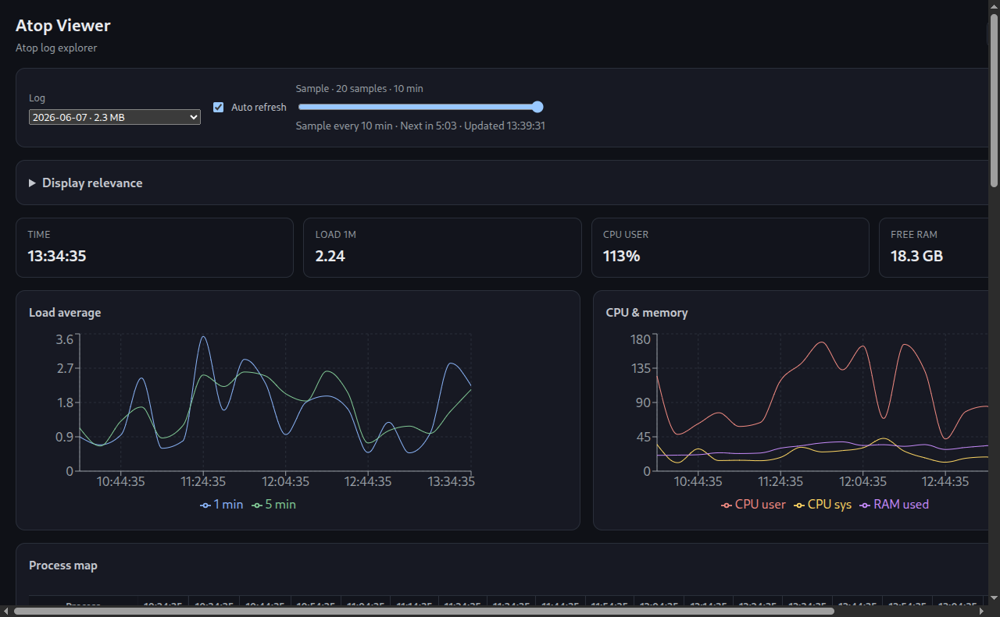

# Atop Viewer

**Desktop GUI for Linux [atop](https://www.atoptool.nl/) historical logs** — atop log analyzer, atop visualizer, performance forensics.

> **Not a browser app.** Linux desktop application (Electron). Requires **`atop` installed** on the same machine. Reads logs via `atop -r … -J …` (no custom binary parser, no `atop -P` step).

**Status:** beta (`0.0.x`) · **License:** [MIT](LICENSE)

| | |
|---|---|
| **Download** | [davidpestana.github.io/atop-viewer](https://davidpestana.github.io/atop-viewer/) |
| **Releases** | [GitHub Releases](https://github.com/davidpestana/atop-viewer/releases) |
| **Source** | [github.com/davidpestana/atop-viewer](https://github.com/davidpestana/atop-viewer) |

---

## What it does

Turn daily atop binary logs (`/var/log/atop/atop_YYYYMMDD`) into an explorable UI for **Linux admins, SRE, DevOps, and platform engineers**:

- **Time slider** across atop samples (load, CPU, memory charts)
- **Process table** with live status (running / terminated / PID reused)
- **Live mode** — polls the log every 15 s when atop writes a new sample
- **Process timelines** — heatmap, stack, lifecycle for top processes
- **Configurable filters** — CPU threshold, row limits, timeline top N
- **ES / EN** UI locale
- **Local only** — data stays on your machine; no upload server

### How parsing works

```
/var/log/atop/atop_YYYYMMDD  →  atop -r LOG -J JSON  →  Atop Viewer UI
```

The app shells out to `/usr/bin/atop`. It does **not** parse raw `.atop` binaries in JavaScript and does **not** require converting logs with `atop -P` first.

---

## Screenshot



---

## Quick start

### 1. Install atop (if needed)

```bash
sudo apt install atop
sudo systemctl enable --now atop
grep LOGINTERVAL /etc/default/atop   # e.g. 600 = one sample every 10 min
```

### 2. Install Atop Viewer

Download the latest `.deb` from [Releases](https://github.com/davidpestana/atop-viewer/releases) or [GitHub Pages](https://davidpestana.github.io/atop-viewer/).

**Recommended** (avoids apt `_apt` warnings when the file is in `$HOME`):

```bash
sudo dpkg -i ~/atop-viewer-*-beta-amd64.deb
sudo apt -f install   # only if dependencies are missing
```

Alternative:

```bash
cp ~/atop-viewer-*-beta-amd64.deb /tmp/
sudo apt install /tmp/atop-viewer-*-beta-amd64.deb
```

> **Note:** `sudo apt install ./file.deb` from `$HOME` may print an `_apt` / *Permiso denegado* **information** line. That is **not** a failed install if you see `Configurando atop-viewer` and `ii` in `dpkg -l atop-viewer`.

### 3. Launch

```bash
atop-viewer
```

Or open **Atop Viewer** from the GNOME application menu.

**AppImage** (other distros): see [Releases](https://github.com/davidpestana/atop-viewer/releases) — still requires `atop` and often `libfuse2`.

---

## Using the app

1. Pick a daily log (`atop_YYYYMMDD`) in the dropdown.
2. Move the **time slider** to inspect a sample interval.
3. Review **system charts** (load, CPU, memory).
4. Inspect the **process table** for that interval.
5. Enable **Live** to follow the current day's log (refresh bounded by atop's `LOGINTERVAL`).
6. Open **Settings** (*Display relevance*) to tune filters and locale.

By default, processes below **0.05% CPU** in a sample are hidden. Set **minimum CPU to 0%** to show idle workloads.

---

## Requirements

| | |
|---|---|
| **OS** | Linux (Ubuntu/Debian tested; AppImage for others) |
| **atop** | Installed, writing to `/var/log/atop/` |
| **Permissions** | Read access to atop logs (user/group or root) |
| **Display** | X11/Wayland desktop (GNOME tested) |

---

## Limitations (beta)

- **Linux desktop only** — not a web UI, not Windows/macOS.
- **Requires atop CLI** on the host — cannot open arbitrary `.atop` files from USB unless readable and passed via atop.
- **Default log path** — `/var/log/atop/atop_YYYYMMDD` (system atop layout).
- **Live refresh** cannot exceed atop's sampling interval (`LOGINTERVAL`, often 600 s).
- **Beta packaging** — `.deb` / AppImage for amd64; APIs and settings may change.

---

## Roadmap

- [ ] Open user-selected log files (not only `/var/log/atop`)
- [ ] Disk and network charts from atop JSON labels
- [ ] Export sample / process data (CSV, JSON)
- [ ] Stable `1.0` after broader distro testing

---

## Development

### Prerequisites

- **Node.js 20+** and npm
- **atop** installed with logs under `/var/log/atop/` (needed to exercise the UI)
- Linux desktop (Electron targets Linux only in this repo)

### Run from source

```bash
git clone https://github.com/davidpestana/atop-viewer.git
cd atop-viewer
npm install
npm run dev
```

`npm run dev` wraps Electron with a clean environment (`scripts/run.sh`) to avoid GTK/Wayland crashes on some setups. Equivalent:

```bash
bash scripts/run.sh dev
```

### Build and package

```bash
npm run build              # compile main, preload, renderer → out/
npm run preview            # run the built app locally
npm run dist:linux         # .deb + AppImage → dist/
npm run dist:linux:check   # build + validate packages (CI uses this)
npm run clean:artifacts    # remove old dist/ output
```

### Project layout

| Path | Role |
|------|------|
| `electron/` | Main process, atop integration, IPC |
| `electron/atop/` | Calls `atop -r … -J …`, log listing, live watch |
| `src/` | React renderer (charts, tables, settings) |
| `build/` | `.desktop`, launcher, Debian postinst |
| `docs/` | GitHub Pages download site |
| `.github/workflows/` | CI build and release automation |

Releases are tagged `v0.0.x` / `v0.0.x-beta`; CI builds installers and updates the [download page](https://davidpestana.github.io/atop-viewer/).

---

## License

[MIT](LICENSE)
